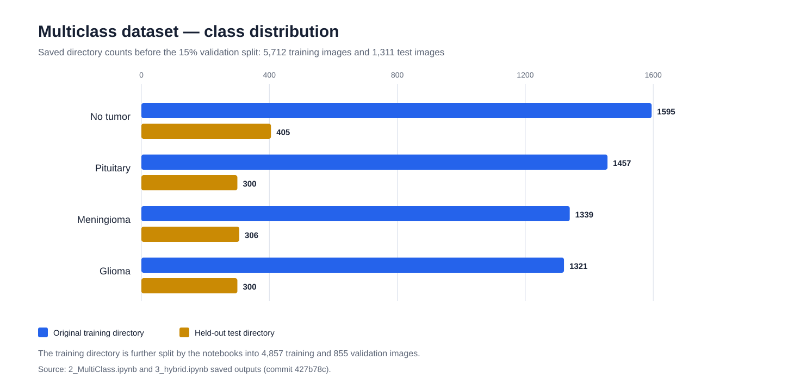
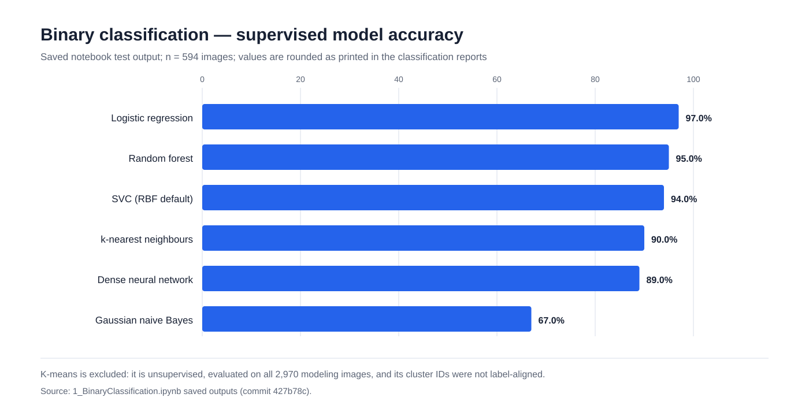
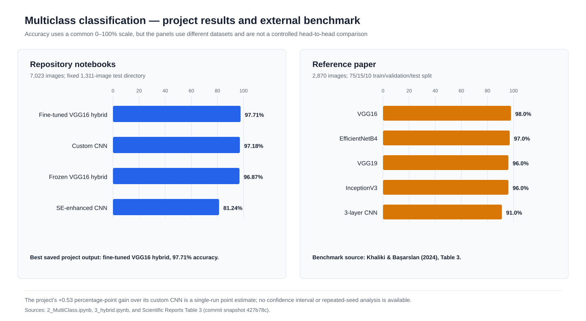

# Brain Tumor MRI Classification: A Methodological Comparison

This repository is a case study of two related MRI classification tasks:

1. **Binary detection** — tumor vs. no tumor using flattened grayscale pixels and classical or shallow machine-learning models.
2. **Four-class classification** — glioma, meningioma, no tumor, or pituitary tumor using a custom CNN, transfer learning, channel attention, and a VGG16–custom-CNN hybrid.

The emphasis is methodological: what changes when the representation moves from flattened pixels to learned convolutional features, and when a custom network is augmented with attention or pretrained features?

> [!IMPORTANT]
> This is an educational experiment, not a clinical diagnostic system. The saved results come from public MRI image datasets and single notebook runs. They have not been externally validated, calibrated for clinical use, or tested for patient-level generalization.

## Technical summary

- On the binary task, **logistic regression has the strongest saved test result (97% accuracy; macro F1 0.97)** among the supervised models evaluated on 594 images. This does not establish that it will generalize to a different acquisition site or patient cohort.
- On the four-class task, the **fine-tuned VGG16–custom-CNN hybrid has the strongest saved result: 97.71% test accuracy, macro F1 0.98, and test loss 0.11887 on 1,311 images**.
- Fine-tuning improves accuracy by only **0.53 percentage points** over the custom CNN (97.71% vs. 97.18%). With one run per model and no confidence intervals, that difference should be treated as suggestive rather than conclusive.
- Adding Squeeze-and-Excitation blocks does **not** improve this implementation: the SE-enhanced CNN reaches 81.24% test accuracy, approximately 15.94 percentage points below the custom CNN.
- The reference-paper scores are useful context, but **not a direct benchmark**: the paper uses a different 2,870-image dataset and split, whereas this repository's multiclass notebooks use a 7,023-image directory split.

All project metrics below were transcribed from saved notebook outputs at repository commit `427b78c`. The machine-readable inventory is in [`results/reported_metrics.csv`](results/reported_metrics.csv).

## Study design

### Notebook map

| Phase | Notebook | Question | Methods with saved code | Evidence status |
|---|---|---|---|---|
| 1 — binary detection | [`1_BinaryClassification.ipynb`](1_BinaryClassification.ipynb) | Can tumor presence be predicted from flattened grayscale intensities? | Logistic regression, SVC, kNN, Gaussian naive Bayes, dense neural network, random forest, K-means | Supervised models have saved test outputs; K-means is not directly comparable |
| 2 — multiclass baseline | [`2_MultiClass.ipynb`](2_MultiClass.ipynb) | How well does a custom CNN compare with VGG16 transfer learning? | Four-block custom CNN; partially unfrozen VGG16 | Custom CNN has a complete test evaluation; VGG16 training is interrupted and has no saved test output |
| 3 — hybridization | [`3_hybrid.ipynb`](3_hybrid.ipynb) | Do channel attention or shallow pretrained features improve the custom CNN? | SE-enhanced CNN; frozen VGG16 blocks 1–2 + custom head; selective fine-tuning | All three variants have saved test-accuracy outputs |

**Repository scope:** the current repository contains **three notebooks**. A fourth notebook is not present in the tracked files, so no fourth methodology or result is inferred here.

### Datasets and evaluation populations

| Task | Dataset represented in the notebooks | Classes | Notebook preprocessing | Split used in saved outputs | Evaluation population |
|---|---|---|---|---|---:|
| Binary | [Br35H Brain Tumor Detection 2020](https://www.kaggle.com/datasets/ahmedhamada0/brain-tumor-detection/data) | no tumor / tumor | grayscale, resize to 200×200, flatten to 40,000 features, min–max scaling | 30 images first held out for prediction examples; remaining 2,970 split 80/20 | 594 |
| Multiclass | [Brain Tumor MRI Dataset](https://www.kaggle.com/datasets/masoudnickparvar/brain-tumor-mri-dataset) as represented by the saved 7,023-image snapshot | glioma / meningioma / no tumor / pituitary | RGB, resize to 150×150, rescale by 1/255; train-time rotation, brightness, shift, shear, and horizontal flip | 5,712-image training directory → 4,857 train + 855 validation; fixed 1,311-image test directory | 1,311 |
| Reference paper only | 2,870-image four-class dataset reported by Khaliki & Başarslan | glioma / meningioma / no tumor / pituitary | paper-specific pipeline | 75% train / 15% validation / 10% test | ≈287 |

The notebooks do not store the datasets, file hashes, patient identifiers, or dataset-version metadata. The current Kaggle multiclass dataset has since changed; the counts above describe the **snapshot used by the saved notebook outputs**, not necessarily the latest download.



## Methods

### Phase 1 — flattened-pixel binary classifiers

Each image is converted to grayscale, resized to 200×200, flattened, and scaled. This makes the binary phase a comparison of decision rules over raw pixel intensities rather than learned spatial features.

| Method | Notebook configuration | Representation | Evaluation note |
|---|---|---|---|
| Logistic regression | `C=0.1` | 40,000 scaled pixels | Complete test report |
| Support vector classifier | scikit-learn defaults (RBF kernel) | 40,000 scaled pixels | Complete test report; exact saved test score 0.9360 |
| k-nearest neighbours | `k=3` | 40,000 scaled pixels | Complete test report |
| Gaussian naive Bayes | default configuration | 40,000 scaled pixels | Complete test report |
| Dense neural network | two equal-width ReLU layers; 32/64 nodes, learning-rate and batch-size grid; 10 epochs | 40,000 scaled pixels | Best model selected by lowest loss on the test split, which makes the reported test estimate optimistic |
| Random forest | 100 trees, `random_state=42` | 40,000 scaled pixels | Complete test report |
| K-means | `k=2`, fit to all 2,970 modeling images | 40,000 scaled pixels | Exploratory only: in-sample and cluster IDs are not aligned to class labels |

### Phase 2 — custom CNN and transfer learning

The custom CNN contains four convolution/max-pooling blocks with 32, 64, 128, and 128 filters, followed by a 512-unit dense layer, 0.5 dropout, and a four-way softmax output. It is trained with Adam and categorical cross-entropy for 30 epochs.

The VGG16 experiment attaches global average pooling, a 512-unit dense layer, 0.5 dropout, and a softmax head. The last ten VGG16 layers are set trainable and the model uses Adam at `1e-4`. The saved run stops during epoch 14 of 20; its evaluation cells contain no output. Therefore, this README does not assign a VGG16 test score to notebook 2.

### Phase 3 — hybrid models

| Variant | Feature extractor | Task-specific head | Training strategy | Parameters reported in notebook | Intended test |
|---|---|---|---|---:|---|
| SE-enhanced CNN | Three custom convolution blocks, each with batch normalization and an SE channel-attention block | Flatten → Dense(128) → Dropout(0.3) → softmax | Adam; 30 epochs | Not retained as a clean summary | Whether channel recalibration alone improves the custom baseline |
| Frozen VGG16 hybrid | ImageNet VGG16 through `block2_pool`, frozen | Two Conv(128) + pooling blocks → Flatten → Dense(512) → Dropout(0.5) → softmax | Adam at `1e-4`; 30 epochs | 5,866,308 total; 5,606,148 trainable | Whether low-level pretrained edges/textures help without deep VGG features |
| Fine-tuned VGG16 hybrid | Same hybrid, then the last 15 model layers are unfrozen except batch normalization | Same custom head | Adam at `1e-5`; early stopping on validation loss, patience 5, restore best weights | Same architecture; trainable set changes during fine-tuning | Whether selective adaptation improves the frozen hybrid |

## Results

### Binary task



| Model | Test accuracy | Macro precision | Macro recall | Macro F1 | Evidence |
|---|---:|---:|---:|---:|---|
| Logistic regression | **97%** | 0.97 | 0.97 | **0.97** | Saved classification report; n=594 |
| Random forest | 95% | 0.95 | 0.95 | 0.95 | Saved classification report; n=594 |
| SVC | 94% | 0.94 | 0.94 | 0.94 | Saved classification report; n=594 |
| kNN | 90% | 0.90 | 0.90 | 0.90 | Saved classification report; n=594 |
| Dense neural network | 89% | 0.89 | 0.88 | 0.88 | Test split also used for hyperparameter selection |
| Gaussian naive Bayes | 67% | 0.68 | 0.67 | 0.67 | Saved classification report; n=594 |
| K-means (`k=2`) | 34% | 0.33 | 0.34 | 0.33 | **Not comparable:** in-sample and cluster labels not aligned |

The binary result suggests that global intensity structure is highly predictive within this dataset. It does not demonstrate robustness to acquisition protocol, preprocessing, or site shift. The small spread between logistic regression, random forest, and SVC should also not be overinterpreted without repeated splits.

### Multiclass task



| Repository model | Test accuracy | Macro F1 | Test loss | Change vs. custom CNN | Evidence |
|---|---:|---:|---:|---:|---|
| Fine-tuned VGG16 hybrid | **97.712%** | **0.98** | 0.11887 | **+0.534 pp** | Saved test evaluation and aggregate classification report |
| Custom CNN | 97.178% | 0.97 | 0.14281 | baseline | Saved test evaluation and aggregate classification report |
| Frozen VGG16 hybrid | 96.873% | not reported | **0.11809** | −0.305 pp | Saved test evaluation; no classification report saved before fine-tuning |
| SE-enhanced CNN | 81.236% | 0.78 | 0.93463 | −15.942 pp | Saved test evaluation and aggregate classification report |
| Notebook 2 VGG16 | — | — | — | — | Training output is incomplete; evaluation cells have no saved output |

Three conclusions are supported by the saved outputs:

1. **The custom CNN is already a strong within-dataset baseline.** Adding frozen shallow VGG16 features does not improve its accuracy.
2. **Selective fine-tuning produces a small point-estimate gain.** The gain is 0.53 percentage points, while test loss is essentially unchanged relative to the frozen hybrid.
3. **The SE implementation underfits or optimizes poorly relative to the baseline.** Attention is not automatically beneficial; architecture capacity, optimization, and placement of SE blocks still matter.

### External reference benchmark

The project cites Khaliki and Başarslan, “Brain tumor detection from images and comparison with transfer learning methods and 3-layer CNN,” *Scientific Reports* 14, 2664 (2024), [doi:10.1038/s41598-024-52823-9](https://doi.org/10.1038/s41598-024-52823-9). The values below come from the paper's [Table 3](https://www.nature.com/articles/s41598-024-52823-9/tables/3), correcting several transcription errors in the markdown cells of `3_hybrid.ipynb`.

| Paper model | Accuracy | F-score | Recall | Precision | AUC |
|---|---:|---:|---:|---:|---:|
| VGG16 | **98%** | **97%** | **98%** | **98%** | **99%** |
| EfficientNetB4 | 97% | 96% | 97% | 97% | 99% |
| VGG19 | 96% | 96% | 96% | 96% | 99% |
| InceptionV3 | 96% | 96% | 96% | 96% | 99% |
| 3-layer CNN | 91% | 90% | 91% | 91% | 98% |

These paper results and repository results should not be subtracted from one another as if they came from the same experiment. Dataset size, split, image resolution, augmentation, optimizer, and implementation all differ.

## Validity and reproducibility audit

The saved outputs are useful for a case study, but the following issues should be resolved before presenting the work as a controlled research benchmark.

| Issue | Where it occurs | Consequence | Recommended correction |
|---|---|---|---|
| Per-class name order is incorrect | Multiclass `CM(...)` calls pass `os.listdir(...)` order (`pituitary`, `notumor`, `glioma`, `meningioma`) while Keras uses alphabetical indices (`glioma`, `meningioma`, `notumor`, `pituitary`) | Overall accuracy and macro/weighted averages remain usable, but named per-class precision/recall/F1 and confusion-matrix labels are misassigned | Derive names with `ordered_names = [name for name, i in sorted(generator.class_indices.items(), key=lambda item: item[1])]` |
| Test scaler is fit independently | Binary notebook uses `scaler.fit_transform(xtest)` | Test-distribution information affects scaling and train/test feature mappings differ | Fit on training only; use `xtest = scaler.transform(xtest)` |
| Test set used for model selection | Dense-network hyperparameters are selected by lowest test loss | Reported test performance is optimistic | Select on a validation split; evaluate the chosen model once on untouched test data |
| ROC uses hard class labels | Binary `plot_metrics` calls `roc_curve(y_true, pred)` | ROC/AUC does not measure threshold behavior correctly | Pass probabilities or decision scores (`predict_proba` / `decision_function`) |
| K-means compared without label alignment | Binary notebook evaluates raw cluster IDs on the fit data | Accuracy depends on arbitrary cluster numbering and is not out-of-sample | Use Hungarian label matching and a held-out evaluation; report ARI/NMI as clustering metrics |
| VGG16 result is incomplete | Notebook 2 stops during epoch 14 and saves no test output | Any VGG16 score stated for that notebook is unsupported | Rerun from a clean environment and save the final evaluation |
| Narrative-only model claims | `3_hybrid.ipynb` mentions ResNet101 and 98% project transfer-learning results without corresponding executable cells or saved evaluations | Claims cannot be audited from the repository | Add the missing notebook/code/output or remove the claims |
| No uncertainty estimates | All notebooks | Small model differences may be sampling or initialization noise | Repeat with fixed seeds; report mean, standard deviation, and bootstrap confidence intervals |
| No patient-level or duplicate audit | All notebooks | Slice-level duplicates or images from the same patient may cross splits | Hash images, inspect near-duplicates, and split by patient/source where identifiers exist |
| Absolute local paths | All notebooks | Notebooks do not run on another machine without editing | Centralize `DATA_ROOT` in configuration or environment variables |
| Environment not pinned | Repository | Dependency drift can change behavior | Add `requirements.txt` or `environment.yml` with tested versions and hardware notes |

### Minimum protocol for the next controlled comparison

1. Freeze a dataset version and publish checksums plus license metadata.
2. Build one stratified, patient-aware train/validation/test manifest and reuse it for every multiclass model.
3. Fix Python, NumPy, TensorFlow, and data-generator seeds; record hardware and wall-clock training time.
4. Select hyperparameters only on validation data.
5. Report accuracy, macro F1, per-class sensitivity/specificity, one-vs-rest ROC-AUC, calibration error, and 95% confidence intervals on the untouched test set.
6. Run at least three to five independent seeds and report parameter count, inference latency, and peak memory alongside predictive performance.
7. Validate the final model on a genuinely external dataset or acquisition site before making a robustness claim.

## Reproducing the current notebooks

The repository does not yet provide a pinned environment or dataset loader. A best-effort local setup is:

```bash
git clone https://github.com/goutham-1902/Brain-Tumor-Classification-Methodological-Comparison-Case-Study.git
cd Brain-Tumor-Classification-Methodological-Comparison-Case-Study

python -m venv .venv
source .venv/bin/activate
python -m pip install --upgrade pip
python -m pip install jupyter numpy pandas matplotlib seaborn plotly scikit-learn opencv-python tensorflow
jupyter lab
```

Before running, replace the absolute dataset paths in each notebook. Because package versions and trained weights are not stored, exact reproduction of the saved numbers is not guaranteed.

To regenerate the README figures and metric inventory from the documented values:

```bash
python scripts/generate_readme_figures.py
```

## Repository structure

```text
.
├── 1_BinaryClassification.ipynb
├── 2_MultiClass.ipynb
├── 3_hybrid.ipynb
├── assets/
│   └── readme/
│       ├── binary_model_accuracy.svg
│       ├── multiclass_accuracy_comparison.svg
│       └── multiclass_class_distribution.svg
├── results/
│   └── reported_metrics.csv
├── scripts/
│   └── generate_readme_figures.py
└── README.md
```

## Citation

If this repository is used in academic work, cite the repository with a commit hash and access date. For the external benchmark, cite:

```bibtex
@article{khaliki2024brain,
  title   = {Brain tumor detection from images and comparison with transfer learning methods and 3-layer CNN},
  author  = {Khaliki, Mohammad Zafer and Başarslan, Muhammet Sinan},
  journal = {Scientific Reports},
  volume  = {14},
  pages   = {2664},
  year    = {2024},
  doi     = {10.1038/s41598-024-52823-9}
}
```

## License and data rights

No `LICENSE` file is currently present in this repository. Add an explicit software license before inviting reuse. Dataset licenses and terms remain those of their original providers and must be reviewed separately.
